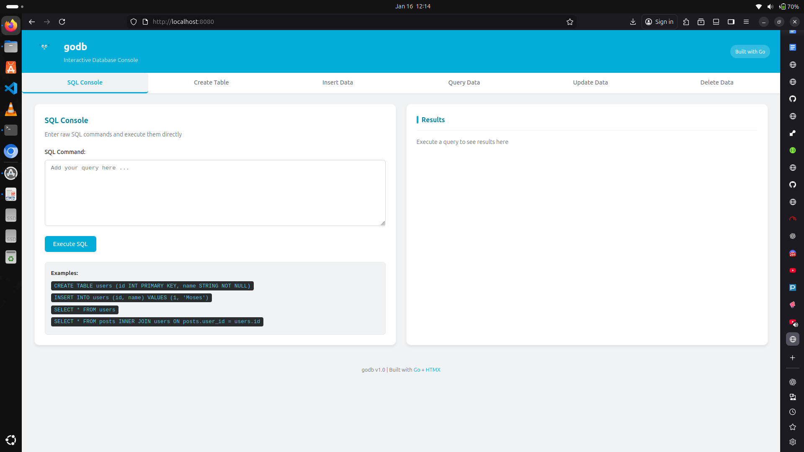
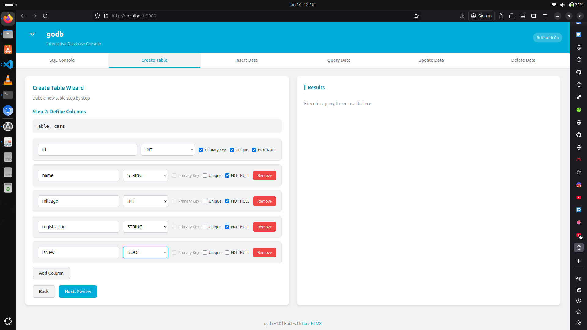
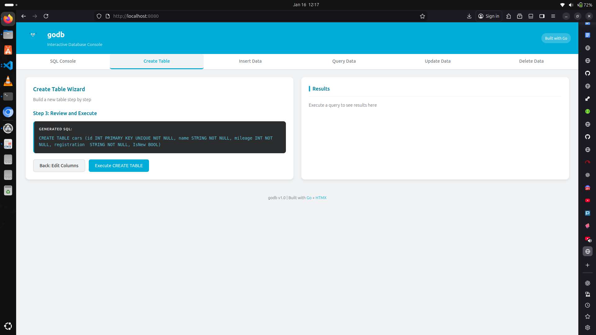
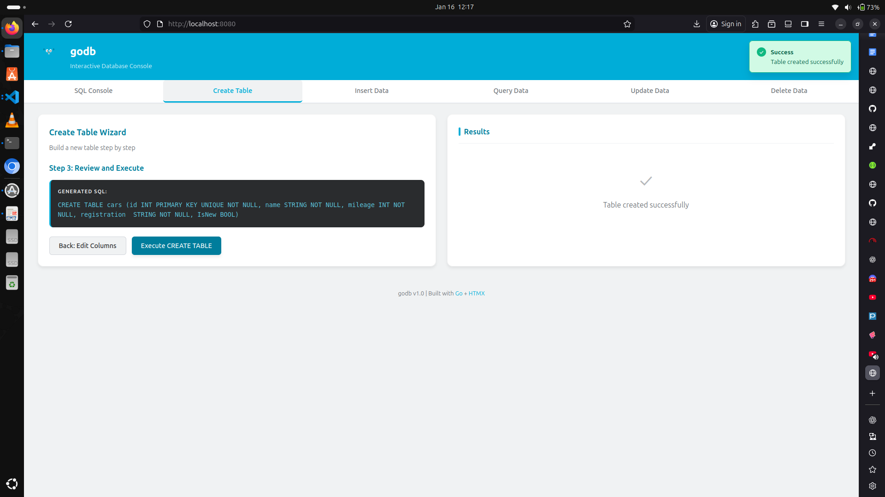

# godb - A Minimal In-Memory Relational Database

A minimal, in-memory relational database implemented in Go, demonstrating clean architecture, constraint enforcement, indexing, and JOIN operations.

## Features

- **Table Creation** with schema definitions (INT, STRING, BOOL types)
- **Constraints**: Primary keys, unique constraints, and NOT NULL enforcement
- **CRUD Operations**: INSERT, SELECT, UPDATE, DELETE with WHERE clauses
- **Hash-based Indexing** for efficient equality lookups
- **INNER JOIN** support with index optimization
- **Three Interfaces**:
  - Interactive REPL for manual database interaction
  - Visual Web UI with query builder and SQL console
  - HTTP REST API for programmatic access

## Architecture

godb follows strict separation of concerns:

```
┌─────────────┐     ┌─────────────┐     ┌─────────────┐
│    REPL     │     │   Web UI    │     │  REST API   │
│   (CLI)     │     │  (Browser)  │     │   (HTTP)    │
└──────┬──────┘     └──────┬──────┘     └──────┬──────┘
       │                   │                   │
       │           ┌───────┴───────┐           │
       │           │               │           │
       └───────────┤    Parser     ├───────────┘
                   │               │
                   └───────┬───────┘
                           │
                  ┌────────▼────────┐
                  │  Database Core  │
                  │    (Engine)     │
                  └─────────────────┘
```

### Core Components

- **engine/**: Database core - tables, rows, constraints, indexes, CRUD, joins
- **parser/**: SQL-like command parsing (no external dependencies)
- **repl/**: Interactive command-line interface
- **web/**: Web server with interactive UI and REST API
  - **templates/**: HTML templates for the visual interface
  - **static/**: CSS styling and HTMX library
  - **handlers.go**: HTTP request handlers
  - **server.go**: Server configuration
- **cmd/**: Entry points for REPL and web server

## Installation & Usage

### Prerequisites

- Go 1.16 or higher

### Building

```bash
# Build REPL
go build -o godb-repl cmd/repl/main.go

# Build Web Server
go build -o godb-web cmd/web/main.go
```

### Running the REPL

```bash
./godb-repl
```

#### REPL Examples

```sql
-- Create a table
CREATE TABLE users (id INT PRIMARY KEY, name STRING NOT NULL, email STRING UNIQUE)

-- Insert data
INSERT INTO users (id, name, email) VALUES (1, 'moses', 'moses@example.com')
INSERT INTO users (id, name, email) VALUES (2, 'Bob', 'bob@example.com')

-- Query data
SELECT * FROM users
SELECT name, email FROM users WHERE id = 1

-- Update data
UPDATE users SET name = 'Moses Otieno' WHERE id = 1

-- Delete data
DELETE FROM users WHERE id = 2

-- Create another table
CREATE TABLE posts (id INT PRIMARY KEY, user_id INT NOT NULL, title STRING, body STRING)

-- Insert posts
INSERT INTO posts (id, user_id, title, body) VALUES (1, 1, 'First Post', 'Hello World')
INSERT INTO posts (id, user_id, title, body) VALUES (2, 1, 'Second Post', 'Another post')

-- Perform JOIN
SELECT * FROM posts INNER JOIN users ON posts.user_id = users.id
```

### Running the Web UI

```bash
./godb-web
```

Navigate to `http://localhost:8080/` in your browser to access the interactive web interface.

#### Screenshots

**SQL Console** - Execute raw SQL commands directly with syntax examples:



**Create Table Wizard** - Visual column builder with type selection and constraints:



**SQL Preview** - Review generated SQL before execution:



**Success Feedback** - Real-time notifications and results:



#### Web UI Features

The web interface provides six main tabs:

**1. SQL Console**
- Execute raw SQL commands directly
- Real-time syntax validation via parser
- Instant results display
- Supports all SQL operations (CREATE, INSERT, SELECT, UPDATE, DELETE, JOIN)

**2. Create Table Wizard**
- Step-by-step table creation
- Visual column builder with type selection
- Constraint configuration (Primary Key, Unique, NOT NULL)
- Single primary key enforcement
- SQL preview before execution

**3. Insert Data**
- Select existing table from dropdown
- Dynamic form generation based on table schema
- Type-appropriate input fields (number for INT, text for STRING, checkbox for BOOL)
- Automatic constraint validation

**4. Query Data**
- Visual SELECT query builder
- Column selection (specific columns or *)
- Optional WHERE clause builder
- Real-time results in formatted tables

**5. Update Data**
- Find rows using condition builder (column, operator, value)
- Edit form pre-populated with current row values
- Primary key fields displayed as read-only
- Original values shown for reference
- SQL preview before execution
- Constraint validation on update

**6. Delete Data**
- Warning banner for irreversible operations
- Condition builder with all comparison operators (=, !=, >, <, >=, <=)
- Preview matching rows before deletion
- Row count confirmation
- Danger-styled UI for destructive actions
- SQL preview before execution

#### Web UI Benefits

- **No SQL knowledge required** for basic operations (use wizards and forms)
- **Parser integration** - same validation as REPL
- **Real-time feedback** - instant error messages and results
- **Modern UX** - clean interface with animations and responsive design
- **Zero page reloads** - powered by HTMX for seamless interactions

### Running the Web Server (API Mode)

```bash
./godb-web
```

The server starts on `http://localhost:8080` and provides:
- **Interactive Web UI** at `http://localhost:8080/`
- **REST API endpoints** (see below)

#### API Endpoints

**Create User**
```bash
curl -X POST http://localhost:8080/users \
  -H "Content-Type: application/json" \
  -d '{"id": 1, "name": "moses", "email": "moses@example.com"}'
```

**Get All Users**
```bash
curl http://localhost:8080/users
```

**Create Post**
```bash
curl -X POST http://localhost:8080/posts \
  -H "Content-Type: application/json" \
  -d '{"id": 1, "user_id": 1, "title": "My Post", "body": "Post content"}'
```

**Get Posts with User Data (JOIN)**
```bash
curl http://localhost:8080/posts
```

## Design Decisions

### 1. In-Memory Storage
- All data stored in memory using Go slices and maps
- Fast access but no persistence
- Suitable for demonstrations, testing, and temporary data

### 2. Hash-Based Indexing
- Indexes use `map[interface{}][]int` structure
- O(1) average lookup time for equality conditions
- Automatically created for PRIMARY KEY and UNIQUE columns
- Can be manually created on any column

### 3. Constraint Enforcement
- **Primary Key**: Uniqueness + NOT NULL automatically enforced
  - Only one primary key allowed per table (enforced in UI and backend)
- **Unique**: Prevents duplicate values using indexes
- **NOT NULL**: Validates presence during INSERT/UPDATE
- Validation happens before data modification

### 4. Simple SQL Parser
- No external parser libraries
- Hand-written tokenizer and recursive descent parser
- Supports essential SQL subset only
- Trade-off: Limited SQL features for zero dependencies

### 5. Thread-Safe Database
- RWMutex on database-level operations
- Safe for concurrent reads, exclusive writes
- Table-level locking (not row-level)

### 6. Join Implementation
- Nested loop join algorithm
- Optimizes right table lookup using index if available
- Only INNER JOIN with equality condition supported
- Column names prefixed with table names (e.g., `users.id`)

## Project Structure

```
godb/
├── cmd/
│   ├── repl/main.go          # REPL entry point
│   └── web/main.go           # Web server entry point
├── engine/
│   ├── database.go           # Database and table registry
│   ├── table.go              # Table schema and storage
│   ├── row.go                # Row representation
│   ├── constraints.go        # Constraint validation
│   ├── index.go              # Hash-based indexes
│   ├── crud.go               # CRUD operations
│   ├── join.go               # INNER JOIN logic
│   └── errors.go             # Domain errors
├── parser/
│   ├── ast.go                # Command structures
│   ├── tokenizer.go          # Input tokenization
│   └── parser.go             # Command parsing
├── repl/
│   ├── repl.go               # REPL loop
│   └── printer.go            # Output formatting
├── web/
│   ├── templates/            # HTML templates
│   │   ├── layout.html       # Base page layout
│   │   ├── console.html      # SQL console tab
│   │   ├── create.html       # Create table wizard
│   │   ├── insert.html       # Insert data tab
│   │   ├── query.html        # Query builder tab
│   │   ├── update.html       # Update data tab
│   │   ├── delete.html       # Delete data tab
│   │   └── results.html      # Results display partial
│   ├── static/               # Static assets
│   │   ├── css/
│   │   │   └── style.css     # UI styling
│   │   └── js/
│   │       └── htmx.min.js   # HTMX library
│   ├── server.go             # HTTP server setup
│   ├── handlers.go           # Route handlers (UI + API)
│   └── dto.go                # Request/response models
├── tests/
│   ├── engine/               # Engine tests
│   └── parser/               # Parser tests
├── screenshots/              # Web UI screenshots
├── go.mod
└── README.md
```

## Testing

Run all tests:

```bash
# Run all tests
go test ./tests/...

# Run with verbose output
go test ./tests/... -v

# Run specific test suite
go test ./tests/engine/...
go test ./tests/parser/...
```

Test coverage includes:
- INSERT with constraint violations
- SELECT with and without indexes
- UPDATE with constraint revalidation
- DELETE operations
- INNER JOIN with and without indexes
- Parser correctness for all command types

## Limitations (By Design)

The following are intentionally **not implemented**:

- **Persistence**: No disk storage or WAL
- **Transactions**: No ACID guarantees, rollback, or commit
- **Advanced SQL**: No GROUP BY, ORDER BY, subqueries, or aggregations
- **Query Optimization**: No query planner or cost-based optimization
- **Authentication**: No user management or access control
- **Network Protocol**: Web server uses HTTP/JSON, not a database protocol
- **Data Types**: Limited to INT, STRING, BOOL

These limitations are deliberate to maintain simplicity and focus on core database concepts.

## Performance Characteristics

- **INSERT**: O(1) with indexing overhead
- **SELECT with indexed equality**: O(1) average
- **SELECT with scan**: O(n)
- **UPDATE/DELETE**: O(n) for condition evaluation
- **JOIN with index**: O(n) for left table, O(1) per right lookup
- **JOIN without index**: O(n * m) nested loop

## Dependencies

- **Go Standard Library Only**
  - `net/http` for web server
  - `html/template` for web UI rendering
  - `encoding/json` for API serialization
  - `bufio` for REPL input
  - `testing` for tests

- **Frontend** (single vendored file)
  - `htmx.min.js` - Enables dynamic UI without page reloads

No external Go dependencies. HTMX is a single JavaScript file vendored in the repository.

## Acknowledgments

This project was conceptualized and designed by [Moses Otieno](https://github.com/moseeh). Development was accelerated with the assistance of [Claude Code](https://claude.ai/claude-code), Anthropic's AI-powered CLI tool, which helped with brainstorming architectural decisions, rapid implementation of features, and debugging.

**Human contributions:**
- Project concept and vision
- Architecture decisions
- Feature requirements and priorities
- Code review and quality control

**AI-assisted contributions:**
- Code implementation and boilerplate generation
- Template and handler scaffolding
- CSS styling patterns
- Documentation drafting

### References & Documentation

The following resources were instrumental in building this project:

- **Go Documentation**: [go.dev/doc](https://go.dev/doc/) - Official Go language documentation
- **Go html/template**: [pkg.go.dev/html/template](https://pkg.go.dev/html/template) - Template engine documentation
- **Go net/http**: [pkg.go.dev/net/http](https://pkg.go.dev/net/http) - HTTP server package
- **HTMX Documentation**: [htmx.org/docs](https://htmx.org/docs/) - HTMX library for dynamic HTML
- **Database Internals**: Concepts inspired by [CMU 15-445 Database Systems](https://15445.courses.cs.cmu.edu/)
- **Claude Code**: [claude.ai/claude-code](https://claude.ai/claude-code) - AI pair programming assistant

## License

This is a demonstration project. Use freely for learning and reference.


